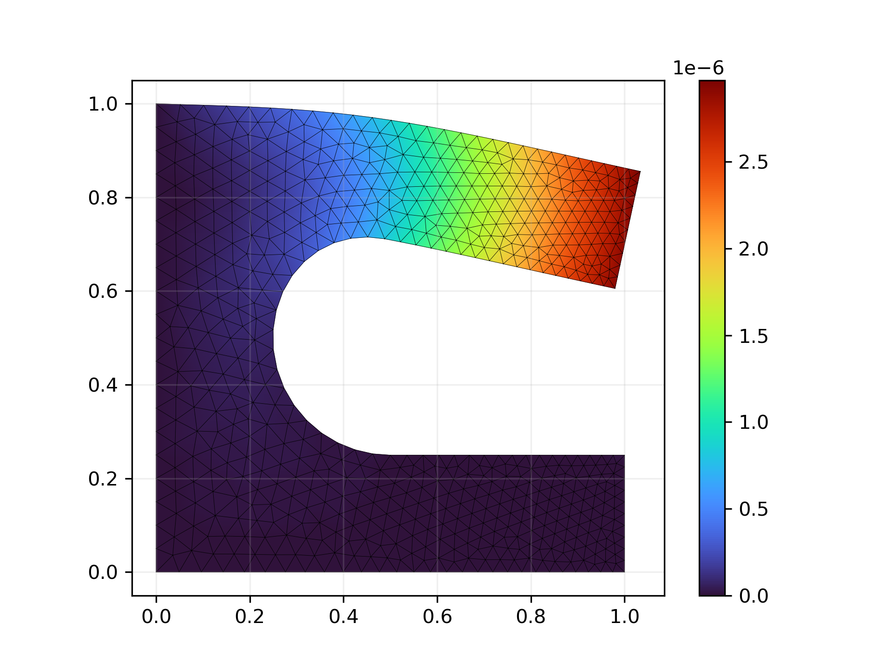

# FEM-Gauntlet

**Grand Prix International 2025 de l'Elément le Plus Fini**

---

## Rules 

Accepted languages :
- C
- C++
- CUDA
- OpenCL and OpenGL


Accepted compiler :
- Any compiler can be used

Accepted libraries :
- All standard libraries of the accepted languages (i.e. all libraries that do not require explicit linking)

Solvers are prohibited.

## The Problem
We will evaluate the speed of your solver on a simplified version of the project, using this mesh. 

The only force acting on the object will be the gravity. The boundary conditions are Homogenous Dirichlet in both the X and Y direction on the bottom and on the left side (called `base` and `symmetry` in the mesh file). All the other boundary domains are left unconstrained (aka Homogenous Neumann).

**The mesh will be exclusively triangular**, there will be no quad meshes. The basis functions in use are the continuous linear Lagrange functions (p1, 3 points, as usual). We assume the use of a 3-point integration rule (or equivalent). **You may use this information to specialize your solver, it doesn't need to be generic**.

## Method of evaluation

Your program must be a shared library called `myFem` that has to contain a function 
```C
elasticity_solve(const char *meshfile, const char *outfile, double E, double nu, double rho, double g);
```
that will be run and timed by `benchmark.c`. An example of an almost-working program is present in the `project` folder. You can modify, copy, reuse, remove or do whatever you want with the content of the `project` folder. At the end, your submission will be the `project` folder with all of its content. 

The calculations will be performed on increasingly refined meshes until the execution time exceeds 10 seconds or the result is incorrect. The final ranking will be based on an estimate of the problem size that the program can solve in 10 seconds.

## To help you get started

To help you test your code, we provide the mesh `data/mesh.txt` together with the expected solution `data/UV_ref.txt`. A valid solution will be one that passes the test as in `validate.py`. A visualization script `plot.py` is also available to view your solution.

If you want to test the performances of your code with various meshes, the program in `genmesh` can be used to generate meshes with various resolutions. Those will be ones used in the final test. Usage:
```bash
./genmesh -clscale 1.0
```
where you replace `1.0` by the desired mesh size factor. A smaller value means more elements.


### File structure of this repository:
```bash
├── benchmark.c    # You can change this, but YOUR CODE MUST WORK WITH THE ORIGINAL 
├── benchmark.h    # DO NOT CHANGE THIS FILE
├── CMakeLists.txt
├── plot.py        # A nice little plotting script
├── validate.py    # The simplified validation script 
├── data
│   ├── mesh.txt   # An example mesh
│   └── UV_ref.txt # The solution on this example mesh
├── genmesh        # mesh generation utility
│   ├── CMakeLists.txt
│   ├── glfw
│   └── src
│       ├── fem.c
│       ├── fem.h
│       ├── geometry.c
│       ├── glfem.c
│       ├── glfem.h
│       └── main.c      # you can modify this to change the mesh resolution
└── project             # This is where you should do almost everything
    ├── CMakeLists.txt  # you can change this
    ├── example.c       # This contains elasticity_solve which will be called.
    │                   # You can change this file, but NOT the function signature.
    ├── fem.c           # you can change this
    ├── fem.h           # you can also change this
    └── homework.c      # you can change this and probably should
```


## Hardware of test machine 
All the projects will be tested on the same hardware, one of the MEMA servers also known as Bobby. It contains

- An [Intel core i5-13500](https://www.intel.com/content/www/us/en/products/sku/230580/intel-core-i513500-processor-24m-cache-up-to-4-80-ghz/specifications.html) CPU
- 32 GB of RAM 
- An [NVIDIA RTX A4000](https://www.techpowerup.com/gpu-specs/rtx-a4000.c3756) GPU

## If you have issues:
Don't hesitate to contact either 
- Nathan Tihon : via teams, or via email nathan.tihon@uclouvain.be
- Miguel De Le Court : via teams, or via email miguel.delecourt@uclouvain.be
